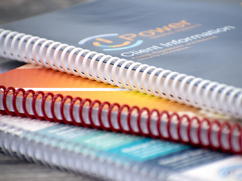

<!DOCTYPE html>
<html lang="en">
<head>
    <meta charset="UTF-8">
    <meta name="viewport" content="width=device-width, initial-scale=1.0">
    <title>BRP PRINTERS</title>
    <link rel = "shortcut icon" type = "x-icon" href="Group 4.png">

</head>
<body style="background: #F5EBE0">
    

        

            

                

                    
<a href="index.html" style="text-decoration: none; color: black;">BRP </a>

                    
<a href="index.html" style="text-decoration: none; color: black;">PRINTERS</a>

                

                

                    
                

            

            

        

        
<a href = "index.html" style = "text-decoration: none; color: black;">HOME</a>

        
<a href = "aboutUs.html" style = "text-decoration: none; color: black;">ABOUT US</a>

        
<a href = "machinery.html" style = "text-decoration: none; color: black;">MACHINERY</a>

        
<a href = "services.html" style = "text-decoration: none; color: black;">SERVICES</a>

        
<a href = "contactUs.html" style = "text-decoration: none; color: black;">CONTACT US</a>

        

            

            
WELCOME TO BRP PRINTERS, CRAFTING QUALITY, DELIVERING EXCELLENCE

        

        

            
            
        

    

    

</body>
</html>

